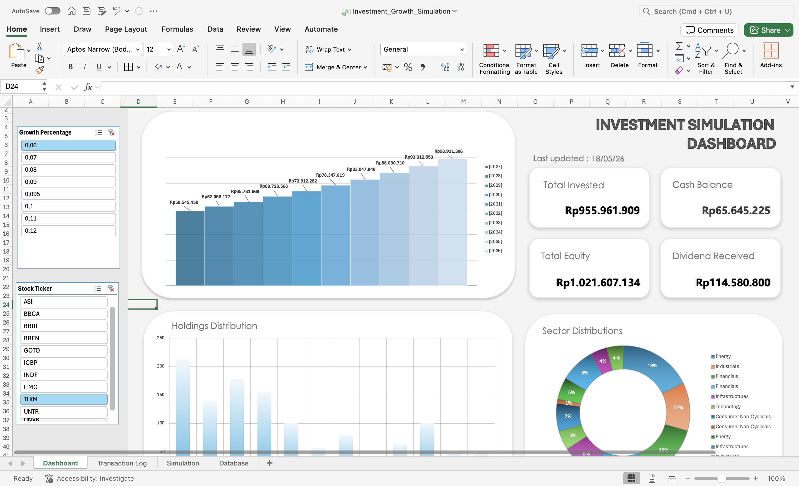
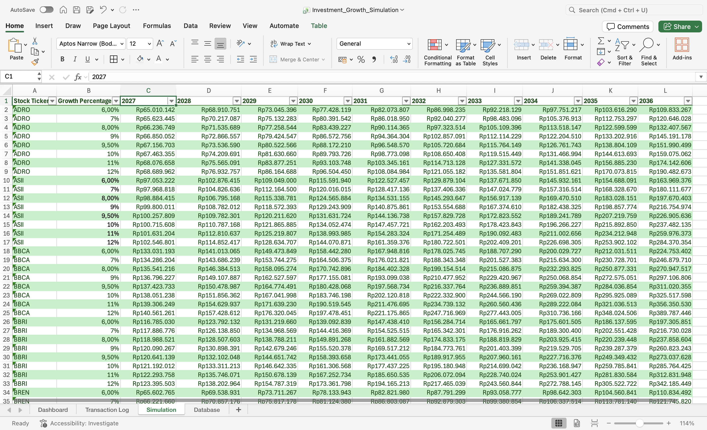

# Investment-growth-simulation
An automated Excel-based investment growth simulation system with dynamic portfolio aggregation and future projection modeling from transaction data.

---

## Dashboard Preview

### Dashboard

### Transaction Log

### Projection Model

---

## Project Purpose

This project was designed to simulate long-term investment growth through transaction-driven portfolio aggregation and compound-growth projection modeling.

The system automatically propagates appended transaction data into portfolio summaries, allocation tracking, and future value simulations through formula-based dependency logic.

---

## Workbook Structure

| Sheet | Purpose |
|---|---|
| Transaction Log | Raw transaction input and historical records |
| Dashboard | Interactive portfolio summaries and allocation overview |
| Simulation | Compound growth simulations across future years |

---

## Key Components

| Component | Description |
|---|---|
| Action | Buy, Sell, or Dividend transaction type |
| Position Change | Positive values for buys, negative values for sells |
| Weighted Average Price | Weighted average purchase price calculated from cumulative buy transactions |
| Growth Percentage | Assumed annual growth rate used for future value simulation |

---

## Features

- Automated transaction-driven portfolio aggregation
- Dynamic portfolio summary updates
- Compound growth simulation across future years
- Interactive dashboard with slicer-based filtering
- Portfolio allocation visualization
- Indonesian stock exchange fee modeling
- Formula-based dependency propagation
- Dummy transaction dataset for simulation purposes

---

## Assumptions & Scope

- Uses assumed annual growth percentages instead of live market pricing
- Uses historical average acquisition price rather than inventory-aware cost basis accounting methods (FIFO/moving average)
- Dividend transactions are assumed to be reinvested
- Dividend taxes are not separately modeled
- Transaction fees are modeled based on Indonesian stock exchange fee structures, including:
  - transaction fees
  - clearing fees
  - settlement fees
  - guarantee fund contributions
  - VAT (PPN)
- Transaction data used in this project is dummy data and does not represent actual market activity

---

## Technical Notes

The workbook is structured around transaction-driven dependency propagation, where newly appended transaction records automatically update:
- portfolio summaries
- investment allocation
- holdings distribution
- projected future portfolio values

The project focuses on analytical modeling, automation logic, and dashboard interaction rather than live market integration.

---

